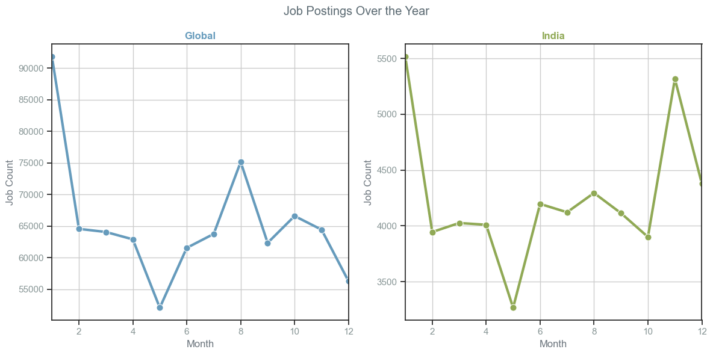
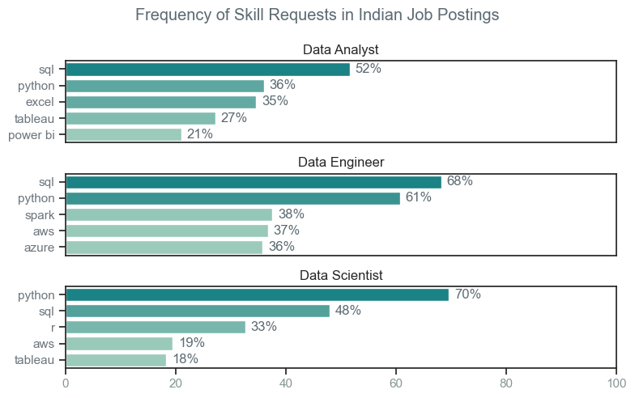
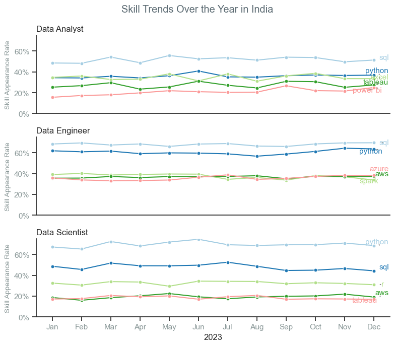
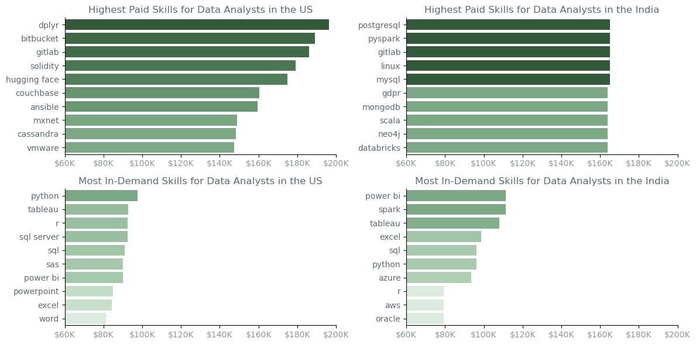
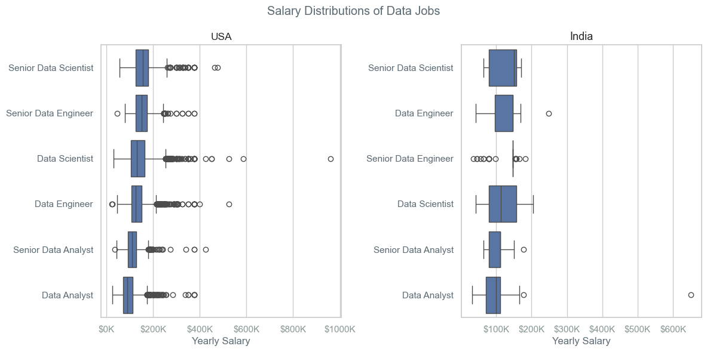
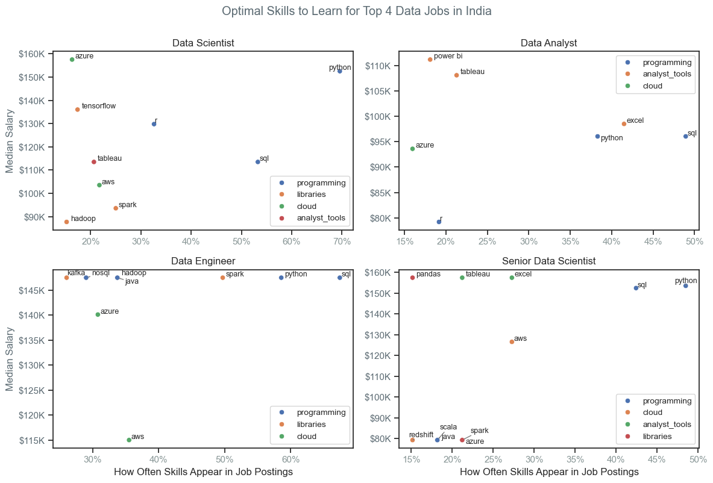

# Overview
This project examines job positions and skill demands in the data industries, focusing on several key factors such as monthly trends, skill requirements, and salary distributions. The [**Data**](https://huggingface.co/datasets/lukebarousse/data_jobs) includes detailed information about job titles, salaries, locations, and important skills which forms the basis of my analysis. The project compares with visualizations of job postings globally and in India, dives into skill demands for various data roles, and investigates income distributions and skill value across countries.
# The Questions
Here is the list of the questions that are going to be answered in this project

1. Exploratory Data Analysis
2. Are monthly job posting trends different globally compared to India?
3. what are the skills that are frequently requested for top data jobs in india ? 
4. What are the skill trends throughout the year for top data jobs in India?
5.  How do salaries vary for the highest paid skills and the most in-demand skills for data analysts in India?
6. How do salaries vary for differnt data job roles in India and in the US ?
7. What are the best skills to learn for data jobs in India that are both in high demand and well-paying?

# Tools I Used
For my deep dive into the data analyst job market, I used a few key tools:

- **python**: this was the main tool for analyzing the data and finding important insights. I also used some python libraries:
  - **pandas**: to handle and analyze the data.
  - **matplotlib**: to create basic graphs and charts.
  - **seaborn**: to make more advanced and detailed visuals.
- **jupyter notebooks**:i used this to run my Python scripts and keep track of my notes and analysis in one place.
- **visual studio code**: this was my main editor for running my python scripts.
- **git & gitHub**: i used these for managing changes to my code and sharing my work, which helped with collaboration and tracking progress.
# Analysis
## 1
### Exploratory Data Analysis
Exploratory Data Analysis (EDA) is a crucial first step in data analysis that involves examining and understanding the data before applying more complex analytical techniques. Here’s a simple breakdown of EDA in this project: 
- analyzing the number of jobs per country
- finding the number of jobs per job title
- investigating the number of jobs per company
- analyzing job benefits through pie charts
- finding the top 3 data jobs in india
- investigating the top 3 data jobs per location in india
- analyzing the top 3 data jobs per company in india

[**Click Here for Line to Line Approach**](/Project/1%20Exploratory%20Data%20Analysis.ipynb)

## 2
### Are monthly job posting trends different globally compared to India?

- analyzing and visualizing job postings data to compare the trends of job postings over the months for a global dataset and for India specifically. The goal is to understand how the job postings fluctuate throughout the year on a global scale versus in India.

[**Click Here for Line to Line Approach**](/Project/2%20Monthly%20Job%20Posting%20Trends%20Global%20vs.%20India.ipynb)
### Methodology
<details>
<summary>
click to toggle contents of "Methodology"
</summary>

**data preparation**
- extract month from date column
- count no of job postings per month globally
- count no of job postings per month in india

**plotting**
- set up for plot
- plot line graphs
- modify axes and labels
- modify the entire figure
- display the plot
</details>

### Code Excerpt
```python
# Setting Up for Plot
fig, ax = plt.subplots(1, 2, figsize=(12, 6))
sns.set_theme(style='ticks')

# Creating Plot
sns.lineplot(data=plot,     x='posted_mo', y='job', ax=ax[0], color= '#669bbc', linewidth=3, marker= 'o', markersize = 8)
sns.lineplot(data=plot_ind, x='posted_mo', y='job', ax=ax[1], color= '#90a955', linewidth=3, marker= 'o', markersize = 8)

# Modifying Axes and Labels
ax[0].set_title('Global', color =  '#669bbc', fontweight='bold')
ax[1].set_title('India',    color= '#90a955', fontweight='bold')

ax[0].set_xlabel('Month',     color = '#6c757d')
ax[0].set_ylabel('Job Count', color = '#6c757d')
ax[1].set_xlabel('Month',     color = '#6c757d')
ax[1].set_ylabel('Job Count', color = '#6c757d')

ax[0].set_xlim(1, 12)
ax[1].set_xlim(1, 12)

ax[0].tick_params(axis='x', labelcolor='#889696') 
ax[0].tick_params(axis='y', labelcolor='#889696')
ax[1].tick_params(axis='x', labelcolor='#889696') 
ax[1].tick_params(axis='y', labelcolor='#889696')

ax[0].grid(True)
ax[1].grid(True)

# Modifying the entire figure
plt.suptitle('Job Postings Over the Year', color = '#5c6b73')


# Displaying the Plot
plt.tight_layout()
plt.show()

```
### Result

*Monthly Job Posting Trends: Global vs. India*
### Insight
- the trend between global job postings and india job postings follows a similar pattern, with job postings being very high at the start of the year and lowest in **may**.
- there are a few key differences:
    - globally, the 2nd highest peak for job postings is in **august**, whereas in india it occurs in **november**, almost reaching the 1st peak.
- in **summer**, job postings are higher globally, while india’s postings remain stable.
- global job postings show more pronounced fluctuations compared to india’s more stable trends.
## 3
### what are the skills that are frequently requested for top data jobs in india ? 
- analyzing skill demand across different job titles in Indian job postings. aiming to identify and visualize the top skills requested for the top job titles, showing the percentage of job postings that mention each skill.

[**Click Here for Line to Line Approach**](/Project/3%20Understanding%20Skill%20Demand%20for%20Top%20Data%20Jobs%20in%20India.ipynb)
### Methodology
<details>
<summary>
click to toggle contents of "Methodology"
</summary>

**data preparation**

- filter indian job data
- explode skills column
- count job postings
- count skill occurrences
- calculate skill percentages
- extract top job titles

**plotting**

- set up for plot
- plot bar graphs
- modify axes and labels
- modify the entire figure
- display the plot
</details>

### Code Excerpt
```python
import matplotlib.colors as mcolors

# Setting Up for Plot
gradient_palette = mcolors.LinearSegmentedColormap.from_list( 'gradient_palette', ['#94d2bd', '#0a9396'], N=100)
sns.set_theme(style='ticks')
fig, ax = plt.subplots(len(job_titles), 1, figsize=(8,5))

# Creating Plot
for i, job_name in enumerate(job_titles):
    df_plt = df_jobs_skills[df_jobs_skills['job'] == job_name].head(5)
    sns.barplot(data=df_plt, x='skill %', y='skills', ax=ax[i], hue='skill count', palette=gradient_palette)

    # Modifying Axes and Labels
    ax[i].set_title(job_name)
    ax[i].set_ylabel('')
    ax[i].set_xlabel('')
    ax[i].get_legend().remove()
    ax[i].set_xlim(0, 100)

    # Set the color of x-axis and y-axis ticks
    ax[i].tick_params(axis='x', labelcolor='#889696')
    ax[i].tick_params(axis='y', labelcolor='#6c757d')

    # Removeing the x-axis tick labels for better readability
    if i != len(job_titles) - 1:
        ax[i].set_xticks([])

    # Labeling the percentage on the bars
    for p, q in enumerate(df_plt['skill %']):
        ax[i].text(q + 1, p, f'{q:.0f}%', va='center', color = '#5c6b73')

# Modifying the entire figure
plt.suptitle('Frequency of Skill Requests in Indian Job Postings', color = '#5c6b73')

# Displaying the plot
plt.tight_layout()
plt.show()
```
### Result

*Understanding Skill Demand for Top Data Jobs in India*
### Insight
- *sql* and *python* are the most important skills for data jobs, coming in the top 2 in every chart.
- **data analysts** put a strong focus on *sql* (52%), followed by *python* (36%). **data engineers** emphasize *python* (70%) more than *sql* (48%). **data scientists** almost equally focus on both skills, with 68% for *sql* and 61% for *python*.
- **data analysts** tend to mix *sql* with *excel* and visualization tools in their work. **data engineers** concentrate on *sql*, *python*, and cloud technologies like *aws* and *azure*. **data scientists** prioritize *python* and *sql*, with a strong emphasis on statistical tools like *r*.
- each role has some unique skills: **data analysts** are notable for *excel* and *tableau*, **data engineers** stand out with their use of *spark*, *aws*, and *azure*, and **data scientists** are distinguished by their use of *r*, along with *aws* and *tableau*.

## 4 
### What are the skill trends throughout the year for top data jobs in India?
- analyzing and visualizing  the monthly trends of skill mentions for the top three job titles in India. tracking how the demand for various skills changes over the months for these job titles, plotting skill appearance rates across the year.

[**Click Here for Line to Line Approach**](/Project/4%20Skill%20Trends%20Throughout%20the%20Year%20for%20Top%20Data%20Jobs%20in%20India.ipynb)
### Methodology
<details>
<summary>
click to toggle contents of "Methodology"
</summary>

**data preparation**

- filter for indian jobs
- filter for top 3 data jobs
- explode skills column
- count job postings per month
- count skill occurrences per month
- calculate skill percentages
- format month number to month name
- extract top job titles

**plotting**

- set up for plot
- plot line graphs
- modify axes and labels
- modify the entire figure
- display the plot
</details>

### Code Excerpt
```python
from adjustText import adjust_text
from matplotlib.ticker import PercentFormatter

# Setting Up for Plot
sns.set_theme(style='ticks')
fig, ax = plt.subplots(len(top3_jobs), 1, figsize=(8, 7))

# Creating Plot
for i, (key, value) in enumerate(top3_jobs.items()):
    # Plotting the line with specified color palette and markers
    line_plot = sns.lineplot(data=value, dashes=False, palette= 'Paired', ax=ax[i], legend=False, marker='o', markersize=5)
    
    # Retrieve colors for each line
    lines = line_plot.get_lines()
    colors = [line.get_color() for line in lines]
    
    # Modifying Axes and Labels
    ax[i].yaxis.set_major_formatter(PercentFormatter(decimals=0))

    # Preparing texts for adjustText with the same color as the line
    texts = []
    for j, column in enumerate(value.columns):
        # Use color from the corresponding line
        color = colors[j] if j < len(colors) else 'black'  # fallback to black if color index is out of range
        texts.append(ax[i].text(11.2, value[column].iloc[-1], column, fontsize=11, color=color))
    
    # Adjusting text to avoid overlap
    adjust_text(texts, ax=ax[i], arrowprops=dict(arrowstyle='->', color='gray'))

    # Removing the x-axis tick labels for better readability
    if i != len(top3_jobs) - 1:
        ax[i].set_xticks([])  # correct method to remove x-axis tick labels

    ax[i].set_title(key, loc='left')
    ax[i].set_xlabel('')
    ax[i].set_ylabel('Skill Appearance Rate',color = '#889696',  fontsize=10)
    ax[i].set_ylim(0, 75)
    ax[i].tick_params(axis='x', labelcolor='#889696')
    ax[i].tick_params(axis='y', labelcolor='#889696')

# Set x-axis label for the last subplot
ax[-1].set_xlabel('2023')

# Modifying the entire figure
plt.suptitle('Skill Trends Over the Year in India', color = '#5c6b73')

# Displaying the plot
sns.despine()  # to remove borders
plt.tight_layout()
plt.show()

```
### Result


*Skill Trends Throughout the Year for Top Data Jobs in India*
### Insight
- *sql* and *python* are the most consistent skills throughout the year.
- *excel* and *tableau* for **data analysts**, *azure* and *spark* for **data engineers**, and *tableau* and *aws* for **data scientists** vary a lot, especially from **may** to **august**.
- monthly trends show **data analysts**' skill percentages changing, with peaks in *sql* and *python* around **may** and **june**. **data engineers** maintain high use of *sql* and *python* throughout the year, with peaks in **january** and **december**. **data scientists** see *python* peak in **june**, while *sql* and *r* fluctuate, reaching their highest in **march** and **may**.
- there isn’t a clear seasonal pattern for **data analysts**, but skill percentages vary. **data engineers** use *sql* and *python* consistently all year, with some variation in other skills. **data scientists** show more pronounced peaks and troughs in *python* and *sql* trends, especially in mid year months.
## 5 
### How do salaries vary for the highest-paid skills and the most in-demand skills for data analysts in India?    
- comparing the top skills for data analysts in the united states and India, focusing on both the highest paid skills and the most in-demand skills. aiming to visualize the median salaries and demand for these skills in both countries through bar plots.

[**Click Here for Line to Line Approach**](/Project/5%20High-Paying%20vs.%20In-Demand%20Skills%20for%20Data%20Analysts%20in%20the%20US%20and%20India.ipynb)
### Methodology

<details>
<summary>
click to toggle contents of "Methodology"
</summary>

**data preparation**

- filter for data analyst
- filter for indian and usa jobs
- explode skills column
- count skill occurrences
- calculate median salary per skill
- extract top skills

**plotting**

- set up for plot
- plot line graphs
- modify axes and labels
- modify the entire figure
- display the plot
</details>

### Code Excerpt
```python
salaries = [mediansalyr_us, countsalyr_us, mediansalyr_ind, countsalyr_ind]

# Setting Up for Plot
fig,ax = plt.subplots(2,2, figsize = (12,6))

# Creating Plot
for i in range(2):
    for j in range(2):
        index = j * 2 + i
        if index < len(salaries):
            palette =  sns.cubehelix_palette(start=2, rot=0, dark=.3, light=.6, reverse=False, as_cmap=True) if i == 0 else sns.cubehelix_palette(start=2, rot=0, dark=.6, light=.9, reverse=False, as_cmap=True)
            sns.barplot(data=salaries[index], x='median', y=salaries[index].index, hue='median', ax=ax[i, j], palette=palette, legend=False)
            
            #  Modifying Axes and Labels
            ax[i,j].xaxis.set_major_formatter(plt.FuncFormatter(lambda x, _: f'${int(x/1000)}K')) # to convert 100000 to $100k at x-axis
            ax[i,j].set_xlabel('')
            ax[i,j].set_ylabel('')
            ax[i,j].set_xlim(60000,200000)
            # Set the color of x-axis and y-axis ticks
            ax[i,j].tick_params(axis='x', labelcolor='#889696')
            ax[i,j].tick_params(axis='y', labelcolor='#5c6b73')

#  Modifying Axes and Labels
ax[0,0].set_title('Highest Paid Skills for Data Analysts in the US',    color = '#5c6b73')
ax[1,0].set_title('Most In-Demand Skills for Data Analysts in the US',  color = '#5c6b73')
ax[0,1].set_title('Highest Paid Skills for Data Analysts in the India', color = '#5c6b73')
ax[1,1].set_title('Most In-Demand Skills for Data Analysts in the India', color = '#5c6b73')

# Displaying the plot
sns.despine()
plt.tight_layout()
plt.show()
```
### Result

*High-Paying vs. In-Demand Skills for Data Analysts in the US and India*
### Insight
- top paying skills in the us include niche technologies like *dplyr* and *gitlab*, while in india, high salaries go to more common skills like *postgresql* and *pyspark*.
- most in-demand skills in the us are *sql* and *python*, with many job openings, whereas in india, *power bi* and *spark* are in demand, though they may not have as many openings compared to *python* and *sql*.
- salaries in the us vary widely for top skills, with specialized skills paying more, while india’s top salaries are more stable.
- skill focus in the us is on traditional tools and business analytics, while india emphasizes modern tech like cloud services and big data tools.
- in summary, the us values specialized skills with high pay, while india focuses on popular tools with steady salaries.
## 6 
### How do salaries vary for differnt data job roles in India and in the US ?  
- comparing salary distributions for the top 6 job titles in the united states and India. visualizing the yearly salary distribution for these top job roles in each country using box plots, allowing for a comparison of salary ranges and medians across different job titles.

[**Click Here for Line to Line Approach**](/Project/6%20Comparing%20Salary%20Distributions%20for%20Top%20Data%20Jobs%20in%20the%20US%20and%20India.ipynb)
### Methodology

<details>
<summary>
click to toggle contents of "Methodology"
</summary>

**data preparation**

- filter for indian jobs
- filter for top 6 data jobs
- calculate median salary per job
- order according to median salary

**plotting**

- set up for plot
- plot box graphs
- modify axes and labels
- modify the entire figure
- display the plot
</details>

### Code Excerpt
```python
salaries = [df_us_top6_jobs,df_ind_top6_jobs]
orders = [order_us,order_ind]

# Setting Up for Plot
sns.set_theme(style='whitegrid')
fig,ax = plt.subplots(1,len(salaries), figsize = (12,6))

# Creating Plot
for i,salary in enumerate(salaries) :
    sns.boxplot(data=salary , x= 'salyr', y= 'job', order=(orders[i]), ax=ax[i])

    # Modifying Axes and Labels
    ax[i].xaxis.set_major_formatter(plt.FuncFormatter(lambda x, _: f'${int(x/1000)}K')) # to convert 100000 to $100k at x-axis
    ax[0].set_title('USA', fontsize = 12.5)
    ax[1].set_title('India', fontsize = 13)
    ax[i].set_xlabel('Yearly Salary', color = '#5c6b73')
    ax[i].set_ylabel('')
    ax[i].tick_params(axis='x', labelcolor='#889696')
    ax[i].tick_params(axis='y', labelcolor='#5c6b73')

# Modifying the entire figure
plt.suptitle('Salary Distributions of Data Jobs', color = '#5c6b73')

# Displaying the plot
plt.tight_layout()
plt.show()
```
### Result

*Comparing Salary Distributions for Top Data Jobs in the US and India*
### Insight
- **senior data scientists** top the salary charts in both india and the usa. they earn a high median yearly salary of around $175k in the usa and $150k in india. their maximum salaries are also impressive, with the highest in the usa reaching up to $200k, and their salaries are generally close to this maximum.
- **senior data engineers** in india do not have the same level of salary significance as those in the usa.
- **data analysts** and **senior data analysts** have lower median salaries compared to other roles, with around $100k for data analysts and slightly above $100k for senior data analysts in both india and the usa.
- **data engineers** and **data scientists** earn more than senior data analysts in both india and the usa. in india, data engineers, in particular, earn more than senior data analysts and even some senior data engineers.
- in the usa, there are some extreme salaries for data scientists where earnings exceed $900k, and in india, there are extreme salaries for data analysts where earnings exceed $600k.
## 7 
### What are the best skills to learn for data jobs in India that are both in high demand and well-paying?
- analyzing and visualizing the relationship between skill appearance frequency and median salary for the top four job titles in India. aiming to identify and display which skills are most beneficial to learn for these job roles based on their appearance frequency and associated median salary.

[**Click Here for Line to Line Approach**](/Project/7%20Skill%20Value%20Analysis%20for%20Leading%20Data%20Roles%20in%20India.ipynb)
### Methodology
<details>
<summary>
click to toggle contents of "Methodology"
</summary>

**data preparation**

- filter for indian jobs
- filter for top 4 data jobs
- count skill occurrences
- calculate median salary per skill
- assign technology column with skill column

**plotting**

- set up for plot
- plot scatter graphs
- modify axes and labels
- modify the entire figure
- display the plot
</details>

### Code Excerpt
```python
from adjustText import adjust_text
from matplotlib.ticker import PercentFormatter

# Setting Up for Plot
fig, ax = plt.subplots(2, 2, figsize= (12,8)) 
positions = [(0, 0), (0, 1), (1, 0), (1, 1)] 

# Creating Plot
for index, (key, value) in enumerate(dict_df.items()):
    if index < len(positions):
        i, j = positions[index]
        sns.scatterplot(data=value, x='skill_percent', y='median', hue='technology', ax=ax[i, j])

        # Prepareing texts for adjustText
        texts = []
        for p, txt in enumerate(value.index):
            texts.append(ax[i,j].text(value['skill_percent'].iloc[p], value['median'].iloc[p], txt, fontsize=9))

        # Adjusting text to avoid overlap
        adjust_text(texts,ax=ax[i,j],arrowprops=dict(arrowstyle='->', color='gray'))

        # Modify Axes and Labels
        ax[i,j].xaxis.set_major_formatter(PercentFormatter(decimals=0))
        ax[i, j].yaxis.set_major_formatter(plt.FuncFormatter(lambda y, _: f'${int(y/1000)}K'))
        ax[i,j].set_title(key)
        ax[i, j].legend(fontsize='small')
        # Set the color of x-axis and y-axis ticks
        ax[i,j].tick_params(axis='x', labelcolor='#889696')
        ax[i,j].tick_params(axis='y', labelcolor='#5c6b73')

# Modifying Axes and Labels
ax[0,0].set_xlabel('')
ax[0,1].set_xlabel('')
ax[1,0].set_xlabel('How Often Skills Appear in Job Postings')
ax[1,1].set_xlabel('How Often Skills Appear in Job Postings')
ax[0,0].set_ylabel('Median Salary', color = '#5c6b73')
ax[1,0].set_ylabel('Median Salary', color = '#5c6b73')
ax[0,1].set_ylabel('')
ax[1,1].set_ylabel('')

 
# Modifying the entire figure
plt.suptitle('Optimal Skills to Learn for Top 4 Data Jobs in India',y=1, color = '#5c6b73')

# Displaying the plot
plt.tight_layout()
plt.show()
```
### Result

*Skill Value Analysis for Leading Data Roles in India*

### Insight
- **data engineers** earn a median salary of $147,500, with top skills being *sql* (67.5%), *python* (58.6%), and *spark* (49.7%).
- **data analysts** have median salaries of $96,050 for *sql* (48.9%) and $98,500 for *excel* (41.5%), making these their top-paying skills.
- **data scientists**, with a median salary of $152,500 for *python* (69.6%), also value *sql* (53.3%) and *r* (32.6%).
- **senior data scientists** have median salaries of $153,576.5 for *python* and $152,500 for *sql*, using a balanced mix of programming, analytical tools, and cloud technologies like *aws* (27.3%).
- **data engineers** focus mainly on programming and libraries, with some emphasis on cloud technologies like *aws* and *azure*.
- **data analysts** primarily use programming and analytical tools, with some experience in cloud technologies like *azure*.

# Overall Insights
- **job posting trends**: both global and indian job postings are highest at the start of the year and lowest in may. global postings have another peak in august, while india’s second peak is in november. global trends are more up and down; india’s are steadier.

- **important skills**: sql and python are key for all data jobs. data analysts use sql and excel, data engineers focus on python and cloud tools, and data scientists use a mix of python, sql, and r.

- **skill changes**: sql and python are important all year. other skills change more, with data analysts and data scientists having noticeable peaks in certain months.

- **seasonal patterns**: no clear patterns for data analysts; data engineers have more stable trends.

- **pay differences**: the us pays more for specialized skills, while india’s salaries are steadier for common skills. the us pays high for niche skills, but india’s top salaries are more stable.

- **salaries**: senior data scientists have the highest pay in both countries. data analysts and senior data analysts earn less. both countries have high salaries and some extreme pay, especially in the us. data engineers and data scientists earn well with skills in sql, python, and spark, while data analysts earn more with skills like excel and sql. senior roles use a mix of programming, analytical tools, and cloud skills.
# Challanges I Faced
this project came with some difficulties, but they were good learning experiences:

- **data inconsistencies:** i had to fix missing or incorrect data to make sure the analysis was accurate.
- **complex data visualization:** it was challenging to create clear charts and graphs from complicated data, but it was important for making the information easy to understand.
- **balancing breadth and depth:** i needed to explore the data thoroughly while also keeping a big-picture view, which was tricky to manage.

# Conclusion
The project provides substantial insights on job posting trends and skill demands in the data industry. it offers an in-depth analysis of the data job market by comparing global and Indian trends, identifying necessary skills for top professions, and analyzing salary distributions. according to the data, while some trends and skills are comparable around the world, regional differences and specialized function needs result in distinct patterns in demand and compensation. this analysis can help professionals plan their careers and corporations develop hiring strategies.

<span style="color:#d7ba7d; font-size:50px;"> End </span>

---
